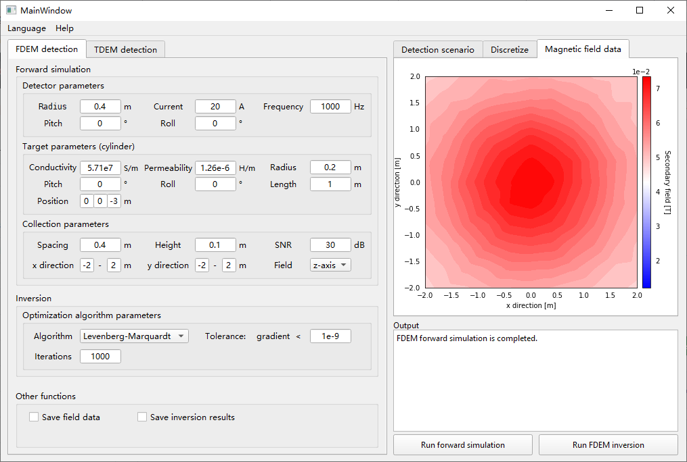

# MICEMD
Modeling, inversion and classification in electromagnetic detection

## Preview

## Getting Started with MICEMD

* **Prerequisite: Installing Python and Conda**

    Currently, *MICEMD* will run on Python 3.5, 3.6, 3.7 and 3.8. And *MICEMD* depends on some packages in Conda, so the [Anaconda](https://www.anaconda.com/products/individual)       or [Miniconda](https://docs.conda.io/en/latest/miniconda.html) should be installed in your system.

* **Installing Packages**

    `conda install SimPEG --channel conda-forge`

    `conda install pyqt`

* **Run MICEMD**

    You can run file *mainwindow.py* in the python IDE or in the command line.

    `python mainwindow.py`
